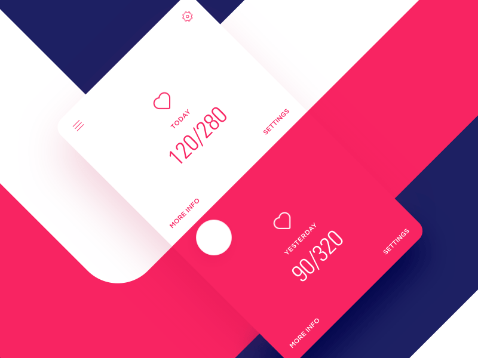

# BouncyPageViewController

[](http://cocoapods.org/pods/BouncyPageViewController)
[](http://cocoapods.org/pods/BouncyPageViewController)
[](http://cocoapods.org/pods/BouncyPageViewController)

Page view controller with bounce effect inspired by motion design by [Stan Yakushevish](https://dribbble.com/shots/2985170-Healthy).
 

|  |  |
| ------------- |-------------|

# Quickstart
### Create a queue of `UIViewControllers` to display
```swift
let pagesQueue: [UIViewController]() = ... // your view controllers here
```
### Create a `BouncyPageViewController ` passing initial view controllers
```swift
let pageViewController = BouncyPageViewController(initialViewControllers: Array(pagesQueue[0...1]))
```
### Assign closures for providing next/pevious view controllers
```swift
pageViewController.viewControllerAfterViewController = self.viewControllerAfterViewController
pageViewController.viewControllerBeforeViewController = self.viewControllerBeforeViewController
```
#### Vend the next ViewController from the queue
```swift
func viewControllerAfterViewController(prevVC: UIViewController) -> UIViewController? {
    if let idx = self.pagesQueue.index(of: prevVC), idx + 1 < self.pagesQueue.count {
        return self.pagesQueue[idx + 1]
    }
    return nil
}
```
### Assign a `didScroll` callback closure
```swift
pageViewController.didScroll = self.pageViewControllerDidScroll
```
#### Update the UI using the `offset` and `progress`
```swift
func pageViewControllerDidScroll(pageViewController: BouncyPageViewController, offset: CGFloat, progress: CGFloat) {
    for vc in pageViewController.visibleControllers() {
        let vc = (vc as! ViewController)
        vc.progress = progress

    }
}
```
# Configuration
#### How much pages overlap eachother, more inset - higher bounce
```swift
    public var pageContentInset: CGFloat = 30
```
#### How long the bounce animates when you release the page
```swift
    public var pageBounceAnimationDuration: TimeInterval = 1
```
#### How far you can scroll the last page until it snaps back (half of the page by default)
```swift
    public var overscrollBounceMultiplier: CGFloat = 0.5
```
## Example

To run the example project, clone the repo

```bash
$ pod install

```

and run as usual.

# Installation
## Requirements
iOS 9+

Swift 3

## Carthage
To use latest release add this to Cartfile:

```ruby
git "https://github.com/BohdanOrlov/BouncyPageViewController"

```
Then run in terminal:

```bash
$ carthage update

```
## CocoaPods

BouncyPageViewController is available through [CocoaPods](http://cocoapods.org). To install
it, simply add the following line to your Podfile:

```ruby
pod "BouncyPageViewController"
```

Due to Swift 3, you have to add this to the end of Podfile:

```ruby
post_install do |installer|
    installer.pods_project.targets.each do |target|
        target.build_configurations.each do |config|
            config.build_settings['SWIFT_VERSION'] = '3.0'
        end
    end
end 
```

## Author

Bohdan Orlov, bohdan.orlov@gmail.com

## License

BouncyPageViewController is available under the MIT license. See the LICENSE file for more info.
